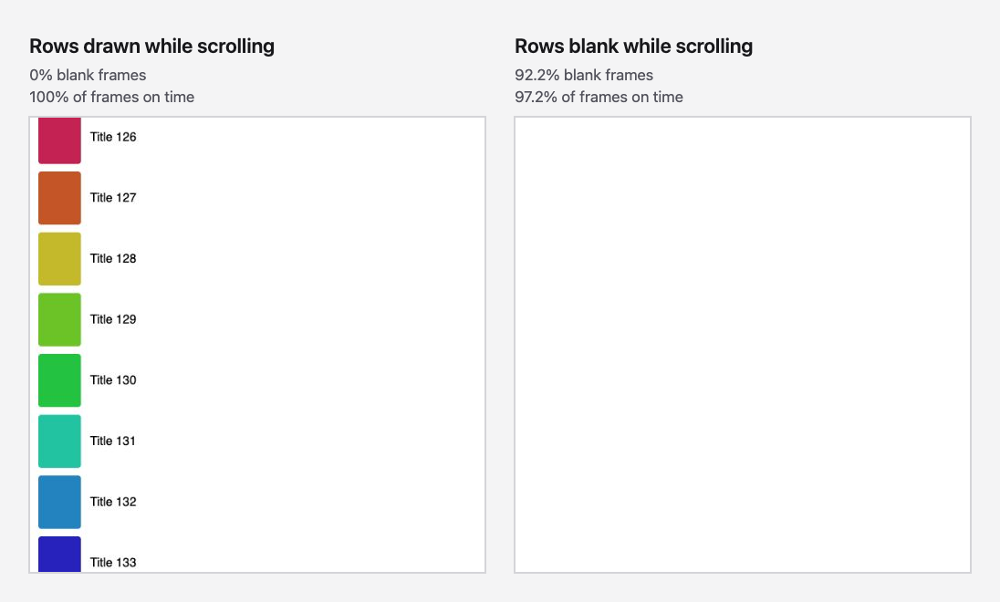

# playwright-smoothness

Fail the build when a web UI stops being smooth. `playwright-smoothness` measures scripted interactions and list scrolling in Chromium, compares each one with a stored baseline, and names the element and the code responsible when it gets worse.



Dropped frames don't show a list going blank. On the right, 97% of frames arrive on time, but the rows aren't there. `smoothness.scroll()` measures both.

> **0.x.** The API may change before 1.0. Reports of noise on your CI runners are especially welcome.

## Quick start

```bash
npm install -D playwright-smoothness
```

Requires Node 20 or later and `@playwright/test` 1.49 or later.

```ts
// tests/smoothness.spec.ts
import { test, expect } from 'playwright-smoothness';

test('filters open smoothly', async ({ page, smoothness }) => {
  await page.goto('/articles');
  const result = await smoothness.measure('open filters', async () => {
    await page.getByRole('button', { name: 'Filters' }).click();
  });
  expect(result).toBeSmooth();
});

test.describe('lists', () => {
  test.use({ hasTouch: true }); // input: 'touch' needs a touch-enabled context
  test('catalogue flick stays drawn', async ({ page, smoothness }) => {
    await page.goto('/catalogue');
    const result = await smoothness.scroll(page.getByRole('list', { name: 'Trending' }), {
      mode: 'full', // blank rows need the trace's screenshots
      input: 'touch', // 'wheel' | 'touch' | 'keys'
      speed: 'fast', // 'slow' | 'normal' | 'fast' | pixels per second
      distance: 20_000, // or 'end'
    });
    expect(result).toBeSmooth();
  });
});
```

Use new headless Chromium, which is closer to real Chrome than the default headless shell:

```ts
// playwright.config.ts
use: { browserName: 'chromium', channel: 'chromium' },
```

The first run records a baseline next to your test, the way `toMatchSnapshot()` does, and passes. Later runs compare with it. Re-record with `npx playwright test --update-snapshots`.

Baselines are per machine (see [Baselines and CI machines](#baselines-and-ci-machines)), so baselines from your laptop aren't used in CI. In CI, record baselines on your main branch and give them to pull-request runs with `baselineDir`. [docs/ci.md](docs/ci.md) has a GitHub Actions recipe.

## What `measure()` does

1. Slows the CPU 4x (`cpuThrottling`), because on a fast machine moderate jank produces no long frames at all.
2. Runs your action once as a warm-up and discards it.
3. Reloads the page, waits until it has loaded and gone quiet (no long frames for 500ms), and runs your action again. It does this 5 times (`runs`).
4. Reports the median of each number, and its spread across runs.

A measurement takes several times as long as the interaction itself, and a traced list fling can take a minute. Raise Playwright's `timeout` (the default is 30 seconds) for these tests.

Only work caused by the interaction counts. Long frames during page load or from background timers are identified and excluded.

If your action can't simply be repeated after a reload, pass your own reset:

```ts
await smoothness.measure('add to cart', action, {
  reset: async ({ page }) => {
    await page.goto('/product/42');
    await page.getByRole('button', { name: 'Accept cookies' }).click();
  },
});
```

## What `scroll()` does

`smoothness.scroll(locator, options)` does the same repeated, reloaded runs as `measure()`, with the scroll as the action:

- `input: 'wheel'` (default) sends a compositor-driven wheel gesture (`Input.synthesizeScrollGesture`).
- `input: 'touch'` flicks with real touch events: press, drag across the list at the requested speed, release (the list flings on), and repeat until the distance is covered. It needs a touch-enabled context (`hasTouch: true`, or a mobile device), and throws without one.
- If the list never moves (for example, the locator isn't the element that scrolls), its blank-frame numbers are reported as unavailable, not as 0%.
- `input: 'keys'` presses the arrow keys 100ms apart and measures each press as an interaction.
- `direction: 'vertical'` (default) or `'horizontal'`. `distance: 'end'` (default) or pixels. On a long or endless list, pass pixels: the end of a 5,000-row list is minutes away.

In full mode it also finds **blank frames**. It screenshots the list at rest, then compares each frame the compositor produced during the scroll with it. A frame drawn to less than half of the resting list is blank. Tell it about skeleton rows, which should count as blank too:

```ts
await smoothness.scroll(list, { mode: 'full', list: { placeholders: ['.skeleton-row', '#e5e7eb'] } });
```

How it works, and its limits: [docs/list-detection.md](docs/list-detection.md).

## What the numbers mean

| Field                        | Meaning                                                                                                | Gated    |
| ---------------------------- | ------------------------------------------------------------------------------------------------------ | -------- |
| `input.p95ToPaintMs`         | Time from input (click, tap, key press) to the next paint, 95th percentile, from the Event Timing API. | Yes      |
| `input.byTarget`             | The same, per element, such as `click on button#checkout`.                                             | No       |
| `longFrames.count`           | Animation frames over 50ms caused by the interaction, from the Long Animation Frames API.              | Yes      |
| `longFrames.totalBlockingMs` | Frame time beyond 50ms, summed. Noisy, so only gated with `gateTotalBlocking: true`.                   | Optional |
| `longFrames.topScripts`      | The scripts that ran in those frames, with `during`: the interactions they blocked.                    | No       |

In full mode (`mode: 'full'`), each run is also traced:

| Field                    | Meaning                                                                                                                                                                    | Gated |
| ------------------------ | -------------------------------------------------------------------------------------------------------------------------------------------------------------------------- | ----- |
| `frames.onTimePercent`   | Frames presented on time, out of frames that had an update to show, from Chrome's frame reporter in the trace. Catches drops that are too short for Long Animation Frames. | Yes   |
| `frames.dropped`         | Frames whose update missed its deadline.                                                                                                                                   | No    |
| `list.blankFramePercent` | `scroll()` only: frames where the list was drawn to less than half of its resting state.                                                                                   | Yes   |
| `list.leastDrawnPercent` | `scroll()` only: the emptiest frame, as a percentage of the list at rest.                                                                                                  | No    |
| `profile.hotFunctions`   | Functions that used the most CPU during the interaction, from V8's sampling profiler, with their callers. Names your handler even behind React's or Angular's dispatcher.  | Never |
| `budget120`              | With `refreshRate: 120`: main-thread frames over 8.33ms. A prediction, because headless Chrome runs at 60Hz.                                                               | Never |

Full mode costs about 5–25% more time per measurement and doesn't change the other numbers ([docs/trace-categories.md](docs/trace-categories.md)).

A check fails when it gets worse than its baseline by more than `maxIncrease` (15% by default), with a small floor so rounding can't fail it: 16ms for input-to-paint (Event Timing reports in 8ms steps), 1 long frame, and 1 percentage point of frames. On-time frames are compared on the missed share, so 95% → 81% can't pass as "within 15%".

Numbers that couldn't be measured are `null` and listed in `unavailable` with a reason. They're never reported as zero.

## Warn first, then fail

`enforce: 'warn'` is the default. A regression adds a `smoothness-warning` annotation, prints the full report, and in GitHub Actions adds a `::warning` to the pull request, but the test passes. Switch a check to `'fail'` once you trust it:

```ts
test.use({ smoothnessOptions: { enforce: 'fail' } });
// or for one assertion
expect(result).toBeSmooth({ enforce: 'fail' });
```

A failure message leads with what got worse and which scripts were responsible:

```
"checkout" is less smooth than its baseline:
  input-to-paint (p95) 64ms (+48ms, +300%), slowest: click on button#heavy

Scripts blocking the interaction:
  1. onHeavyClick in click.js (BUTTON#heavy.onclick): ran 60ms, 12.6ms of it blocking, during click on button#heavy
```

## Options

Set them for a file with `test.use({ smoothnessOptions: { ... } })`, per call as the third argument to `measure()`, or for a whole project in `playwright.config.ts`:

```ts
import { defineConfig } from '@playwright/test';
import type { SmoothnessTestOptions } from 'playwright-smoothness';

export default defineConfig<SmoothnessTestOptions>({
  use: { channel: 'chromium', smoothnessOptions: { runs: 3 } },
});
```

| Option              | Default                                    |                                                                                                                     |
| ------------------- | ------------------------------------------ | ------------------------------------------------------------------------------------------------------------------- |
| `runs`              | `5`                                        | Measured runs. The median is reported.                                                                              |
| `cpuThrottling`     | `4`                                        | CPU slowdown. `1` turns it off.                                                                                     |
| `maxIncrease`       | `0.15`                                     | Allowed increase over the baseline.                                                                                 |
| `enforce`           | `'warn'`                                   | `'warn'` or `'fail'`.                                                                                               |
| `reset`             | `'reload'`                                 | `'reload'`, `'none'`, or an async function.                                                                         |
| `baselineDir`       | none                                       | A directory of baselines from your main branch, checked before the ones next to the test.                           |
| `gateTotalBlocking` | `false`                                    | Also gate total blocking time.                                                                                      |
| `mode`              | see below                                  | `'quick'` or `'full'`. Full mode adds a Chrome trace: dropped frames, a CPU profile, and blank rows for `scroll()`. |
| `list`              | `{ background: 'auto', placeholders: [] }` | `scroll()` in full mode: what counts as blank.                                                                      |
| `refreshRate`       | `60`                                       | `120` adds a reported-only 120Hz prediction in full mode.                                                           |

The mode comes from the option, then `SMOOTHNESS_MODE`, then scheduled CI runs (`full`), then `quick`. See [docs/mode-detection.md](docs/mode-detection.md).

## Automatic mode: every test, no code changes

```ts
// tests/fixtures.ts
import { test as base } from '@playwright/test';
import { withSmoothness } from 'playwright-smoothness';
export const test = withSmoothness(base, { auto: true });
```

Every test that imports `test` from your fixtures file is measured once for its whole run, across navigations, and compared with the median of its recent passing runs on your main branch. Each interaction is listed with its element (`click on button#checkout: 180ms`). Editing a spec file starts its history again instead of failing. How it works, and how to keep the history in CI: [docs/automatic-mode.md](docs/automatic-mode.md).

## Summary for pull requests

Add the reporter next to your usual one:

```ts
// playwright.config.ts
reporter: [['list'], ['playwright-smoothness/reporter']],
```

It writes `test-results/smoothness/summary.md`: every check's change against its baseline (`129ms (+20ms, +18%)`), the scripts and functions behind anything that got worse, and everything that couldn't be measured or compared. In GitHub Actions it's also added to the job summary. Options: `outputFile`, `title`, and `githubSummary` (default: on when `$GITHUB_STEP_SUMMARY` is set). [docs/ci.md](docs/ci.md) shows how to post it as a pull-request comment.

## Choosing `maxIncrease`: calibrate

```bash
npx playwright-smoothness calibrate --runs 5 -- --project=chromium
```

This runs your suite 5 times on unchanged code, with `toBeSmooth()` neither comparing nor recording, and prints how much each check's numbers moved between runs, with the smallest `maxIncrease` (in steps of 0.05) that would have absorbed it. It warns when a check needs more than the default 0.15 and names the noisy metric. Changes within a check's floors (16ms, 1 long frame, 1 point) can't fail it, and calibrate says so. Everything after `--` goes to `playwright test`. Results are also written to `smoothness-calibration.json`. Run it on the machine that gates, such as your CI runner.

## Baselines and CI machines

Baselines are keyed by label, test, project, platform, mode, refresh rate, CPU throttling, and **CPU model**. On GitHub's hosted runners the same job lands on different CPUs, and the same work took 150ms, 197ms, or 226ms depending on which one ([measurements](docs/measurements.md)). A baseline from one CPU model is never compared with a run on another. The result says which machines have baselines instead. For stable gating, use a dedicated runner, or keep baselines for each CPU model your hosted runners use.

## Frameworks

With React, Angular (with or without Zone.js), and likely other frameworks, the browser's Long Animation Frames API names the framework's event dispatcher, not your handler, because it only records the function the browser called. Event Timing does name the element, so every script in a report is linked to the interactions it blocked. In full mode, the CPU profile goes further and names the handler itself, such as `busyWait ← onCheckout ← executeDispatch`, using your source maps to undo minification when the page publishes them. See [docs/frameworks.md](docs/frameworks.md).

## Output

Every result is written as JSON (`schemaVersion: 1`) under `test-results/smoothness/` and attached to the Playwright report, with the comparison included.

## Limitations

- **Chromium only.** In Firefox and WebKit, measurements are skipped with a `smoothness-skipped` annotation and `null` results.
- **Main-thread attribution.** Long frames and scripts come from the main thread. Compositor-only jank isn't attributed.
- **Noise.** Results within one CI job are steady (about ±2% on GitHub's runners), but runner hardware varies between jobs; see above.
- **Headless.** Use new headless (`channel: 'chromium'`). The older headless shell is detected and warned about.
- **120Hz is a prediction.** Headless Chrome runs at 60Hz; `budget120` counts main-thread frames over 8.33ms, and is never gated.
- **Fast interactions are invisible to Event Timing.** Interactions under 16ms aren't reported by the browser, so `input.interactions` counts slower ones only.
- **Navigation.** An action that navigates to a new document can't be measured; the result says so.

## Examples

- [`examples/plain-site`](examples/plain-site): a static page with a button and a long list. CI checks the baseline recipe against it end to end.
- [`examples/react-list`](examples/react-list): a minified React windowed list, where full mode names the slow component through source maps.
- [`examples/github-actions`](examples/github-actions): the CI workflow from [docs/ci.md](docs/ci.md), ready to copy.

## Licence

MIT
