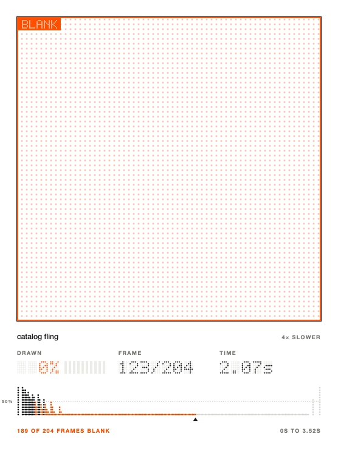

# Blank rows in lists

When a virtualized list can't build its rows in time, the user flings into empty space, and dropped frames don't show it: in the costly test list, 97% of frames were on time while 91% were blank. `smoothness.scroll()` in full mode measures it directly from the trace's screenshots.

## How it works

For each measured run:

1. After the page settles, before tracing, the library reads the list's client area (its box without borders or scrollbars, so a scrollbar can't count as content), resolves the colors that count as blank, and screenshots the list at rest as the reference.
2. The gesture is traced with screenshots. Chrome records one JPEG per frame the compositor produces, about 200 for a 3.3-second fling, at a reduced size (500×500 for a 600×600 viewport; the scale is worked out per image).
3. After tracing, each screenshot is cropped to the list and measured, and so is the reference.
4. A frame is blank when it's drawn to less than half of the reference (`BLANK_FRAME_SHARE`).

### What "drawn" means

A drawn list is still mostly background: padding, gaps, and each row's own fill. So counting background pixels says little. Instead the library counts lines: pixel rows for vertical scrolling, pixel columns for horizontal. A line has content when at least 1% of its pixels (and at least 2) differ from every blank color by more than 24 per channel. The tolerance absorbs JPEG noise.

A drawn row of the test list has content on 70 of its 80 lines: its 70px poster. So a fully drawn test list measures 87.5%. Comparing each frame with the list's own reference means sparse layouts aren't penalized for their whitespace.

### Blank colors

- `list.background: 'auto'` (the default) uses the list's computed background, walking up to the first ancestor with an opaque one, or white if there's none (with a note). It can also be any CSS color.
- `list.placeholders` adds colors that count as blank: CSS colors, or selectors whose element's background is used, such as skeleton rows. A selector that matches nothing at the start of a run is ignored, with a note.

### Why decode in the browser

Trace screenshots are JPEGs. The options were a JPEG decoder in Node (a dependency such as `jpeg-js`, a pure-JavaScript decoder), or the browser that's already running. The library decodes in a throwaway page of the same Chromium, with `createImageBitmap` and `OffscreenCanvas`, after tracing has stopped:

- no dependency;
- Chrome's native decoder: 200 frames decode and measure in about 0.5s locally and 1.2s on a 4-vCPU GitHub Actions runner, inside a 2-second budget (asserted in `tests/integration/list.spec.ts`);
- the throwaway page is in its own browser context, so it can't affect the page being measured.

The line-counting function (`src/list/coverage.ts`) is plain code with no dependencies. It runs in that page, and unit tests call it directly in Node.

## Replays

A replay turns a measured run's screenshots into a WebM video attached to the test (`smoothness replay: <label>`). The run chosen is the one whose blank-frame share is closest to the reported median. Each frame shows the list outlined; on a blank frame it's covered with an orange halftone screen and tagged **BLANK**. Underneath, a small display reads out how drawn the list was (with a ten-segment meter), the frame number and the time, over a waveform of the whole run: one column of dots per frame, placed by time and as tall as the frame was drawn, orange when blank, with a dotted line at the blank threshold. It plays 4× slower than real time (`REPLAY_SLOWDOWN`), because at 60 frames a second a blank frame lasts 16ms.

- `replay: 'on-regression'` (the default) attaches one when a check got worse. `'on'` attaches one for every full-mode `scroll()`, and `'off'` never.
- It's made after the test body, from frames the measurement already recorded, so it doesn't affect the numbers. When no replay is wanted, nothing is encoded.
- Encoding uses WebCodecs (`VideoEncoder`, VP8) in a throwaway page of the same Chromium; that page is on `http://localhost` because WebCodecs needs a secure context. The WebM container is written by the library (`src/replay/webm.ts`), including cues, so the report's player can seek. There are no dependencies. A 3.3-second fling becomes a 15-second replay of about 550KB, encoded in under a second locally.

## Results

The test list (`test-pages/list.html`), 600×600, flung 20,000px at 6,000px/s with the mouse wheel, no CPU throttling, median of 3 runs. Locally, Chrome 153:

| List                                                               | Frames on time | Dropped | **Blank frames** | Least drawn |
| ------------------------------------------------------------------ | -------------- | ------- | ---------------- | ----------- |
| Cheap (0ms per row, overscan 2)                                    | 100%           | 0       | **0%**           | 100%        |
| Moderate (4ms per row, overscan 2)                                 | 100%           | 0       | **0%**           | 100%        |
| Costly (15ms per row, no overscan)                                 | 97.2%          | 6       | **90.7%**        | 0%          |
| Costly, dark background (`#202020`)                                | –              | –       | **> 50%**        | –           |
| Horizontal, cheap / costly                                         | –              | –       | **0% / 92.2%**   | 100% / 0%   |
| Skeleton rows (grey for 250ms), not named / named as a placeholder | –              | –       | **0% / 97.5%**   | 89.6% / 0%  |

On GitHub Actions (AMD EPYC 9V74, 4 vCPU, PR #5): cheap 0%, costly 92.2% (188 of 204 frames, with 97.2% of frames on time), horizontal 0% / 92.6%, skeleton rows 0% / 97.5%. Analyzing 200 frames took 1.2s, inside the 2-second budget but with less room than locally (0.5s).

## Limitations

- Blank rows need full mode. Quick mode has no screenshots; `scroll()` in quick mode reports long frames and input, and notes that blank rows need full mode.
- The list must be visible, and the reference must have some content: a list drawn in its own background color can't be judged, and is reported as unavailable.
- Screenshots only cover the viewport, so parts of the list outside it aren't measured.
- Touch scrolling is a series of flicks made of real touch events (`Input.dispatchTouchEvent`), and needs a touch-enabled context (`hasTouch: true`, or a mobile device): `scroll()` checks `navigator.maxTouchPoints` and throws if it's 0. `Input.synthesizeScrollGesture` with a touch source isn't used, because on Linux it scrolls nothing and reports no error (see measurements.md).
- A list that doesn't move isn't measured. If no run scrolled it, `list` is null and listed in `unavailable`: 0% blank would describe a list that stood still.
- `distance: 'end'` stops after 20,000px (`END_CAP_PX`), with a note giving the real distance to the end. The test list's end is 399,400px away: over a minute per run at 6,000px/s, a trace of hundreds of MB with screenshots, and a distance that changes whenever the data does. A pixel distance you pass isn't capped.
- `input: 'keys'` presses arrow keys 100ms apart, at most 100 presses per run. Presses faster than 16ms aren't reported by Event Timing (its minimum threshold), so `input.interactions` counts the slow ones; `scroll.keyPresses` says how many there were.
