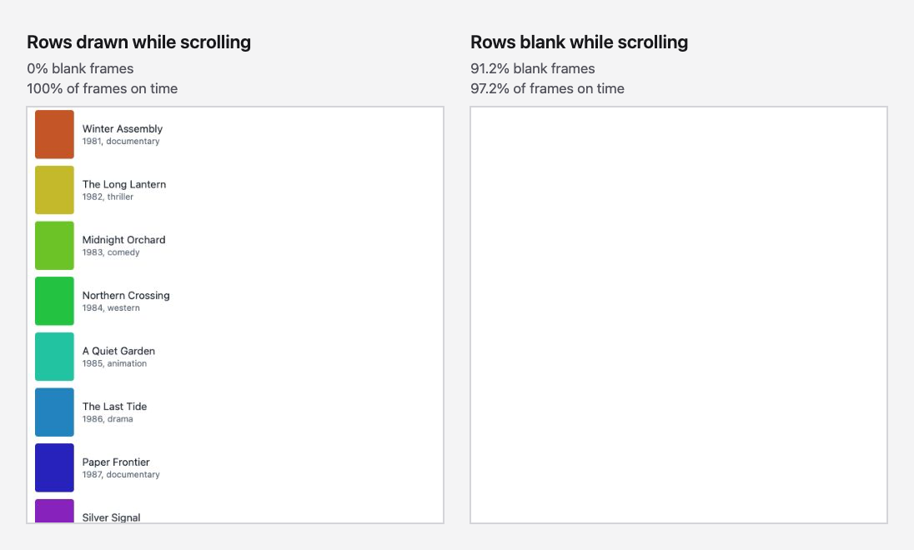
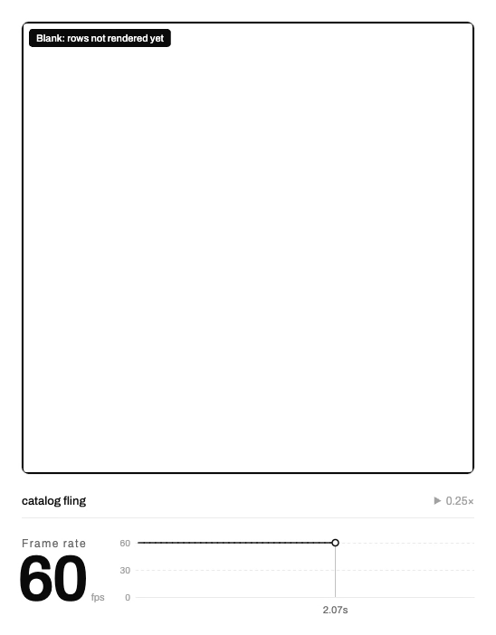

# Blank rows in lists

A virtualized list that can't build its rows in time leaves the user scrolling through empty space, and the frame rate doesn't show it. In the costly test list below, 97% of frames were on time while 91% were blank. In full mode, `butter.scroll()` finds these blank frames in the trace's screenshots. The [README](../README.md#scroll-a-list) covers the options, and this page explains how the measurement works.

## Judging a frame

Each measured run goes through four steps:

1. After the page settles, and before tracing starts, the library reads the list's client area (its box without borders or scrollbars, so a scrollbar can't count as content). It works out which colors count as blank and takes a screenshot of the list at rest to use as the reference.
2. The scroll is traced with screenshots. Chrome records one JPEG for each frame the compositor produces, about 200 for a 3.3-second fast scroll. The images are smaller than the page (500×500 for a 600×600 viewport), so the scale is worked out for each one.
3. After tracing, each screenshot is cropped to the list and measured, and so is the reference.
4. A frame is blank when it's drawn to less than half of the reference (`BLANK_FRAME_SHARE`).

### Counting drawn lines

Even a fully drawn list is mostly background: padding, gaps and each row's own fill. Counting background pixels says little, so the library counts lines instead, meaning pixel rows for vertical scrolling and pixel columns for horizontal scrolling. A pixel is blank when each of its red, green and blue values is within 24 of a blank color, a tolerance that absorbs JPEG noise. A line has content when at least 1% of its pixels (and at least 2) aren't blank.

Each row of the test list is 80 lines tall, and 70 of them have content (the row's 70px poster), so a fully drawn test list measures 87.5%. Because each frame is compared with the list's own reference, a sparse layout isn't penalized for its whitespace.

### Blank colors

- `list.background: 'auto'` (the default) uses the list's computed background. If that's transparent, it walks up to the first ancestor with an opaque background, and falls back to white with a note if there's none. It can also be set to any CSS color.
- `list.placeholders` adds more colors that count as blank. Each entry is a CSS color or a selector, and for a selector the matching element's background color is used, which suits skeleton rows. A selector that matches nothing at the start of a run is ignored, with a note.

### Detecting a virtualized list

While each run scrolls, a `MutationObserver` counts the elements removed from inside the scroller. If a run removes at least 3 (`MIN_REMOVED_ROWS`), the list counts as virtualized and `list.virtualized` is `true` in the result. An ordinary page removes nothing as it scrolls, and neither does an infinite list that only appends rows.

On a list that isn't virtualized, blank frames are still measured and reported, but they aren't gated. There, a frame drawn to less than half of the starting view means the content further down has more empty space, and nothing was late to draw. The result gets a note saying so, and the replay shows the frame rate without marking any rows as not drawn. `list: { virtualized: true }` or `false` overrides the detection.

### Decoding in the browser

Trace screenshots are JPEGs. They could be decoded in Node with a dependency such as `jpeg-js` (a pure-JavaScript decoder), but the library uses the Chromium that's already running. After tracing stops, it decodes them in a throwaway page with `createImageBitmap` and `OffscreenCanvas`. This has three advantages:

- It adds no dependency.
- Chrome's native decoder is fast. 200 frames decode and measure in about 0.5s locally and 1.2s on a 4-vCPU GitHub Actions runner, inside a 2-second budget that `tests/integration/list.spec.ts` asserts.
- The throwaway page has its own browser context, so it can't affect the page being measured.

The line-counting function (`packages/butter-core/src/list/coverage.ts`) is plain code with no dependencies. It runs in that page, and unit tests call it directly in Node.

## Replays

A replay is a WebM video of one extra run, made after the measured runs, and attached to the test as `smoothness replay: <label>`. The [README](../README.md#replays) covers when a replay is attached.

Each frame of the video shows the list with an outline. On a blank frame, the outline turns black and a tag reads **Blank: rows not rendered yet**, with the empty list still visible inside it. Below the list, the frame rate over the last 250ms appears in large type, in red when frames are being dropped. It's the share of frames presented, out of those that had something to show, expressed at 60Hz. Beside it, a chart of the frame rate across the run draws in as the video plays, black at 60 frames per second and red below that, with the elapsed time under the playhead. The video plays at a quarter of real speed (`REPLAY_SLOWDOWN`), because at 60 frames a second a blank frame lasts only 16ms. The panel is set in Archivo, which the package includes, so a replay looks the same on every machine.

Recording frames takes compositor time, so the replay's run is kept apart from the measured runs and never counted. Its frames come from Chrome's screencast (`Page.startScreencast`) at the page's own size, up to 1280px on the longer side. A trace's screenshots would be too small for a desktop-sized page: Chrome fits them in 250px or 500px, depending on its version. The panel is laid out for a 500px recording and scales up with a wider one. With `replay: 'off'` there's no extra run, and when no replay is wanted, nothing is encoded.

Encoding uses WebCodecs (`VideoEncoder`, VP8) in a throwaway page of the same Chromium. That page is served from `http://localhost`, because WebCodecs needs a secure context. The library writes the WebM container itself (`packages/butter-core/src/replay/webm.ts`), including cues so the report's player can seek, and has no dependencies for it. A 3.3-second fast scroll becomes a 15-second replay of about 500KB, encoded in under a second locally.

## Results

These numbers come from the test list (`test-pages/list.html`), 600×600, scrolled 20,000px at 6,000px/s with the mouse wheel, with no CPU throttling. Each is the median of 3 runs, measured locally on Chrome 153:

| List                                                               | Frames on time | Dropped | **Blank frames** | Least drawn |
| ------------------------------------------------------------------ | -------------- | ------- | ---------------- | ----------- |
| Cheap (0ms per row, overscan 2)                                    | 100%           | 0       | **0%**           | 100%        |
| Moderate (4ms per row, overscan 2)                                 | 100%           | 0       | **0%**           | 100%        |
| Costly (15ms per row, no overscan)                                 | 97.2%          | 6       | **90.7%**        | 0%          |
| Costly, dark background (`#202020`)                                | –              | –       | **> 50%**        | –           |
| Horizontal, cheap / costly                                         | –              | –       | **0% / 92.2%**   | 100% / 0%   |
| Skeleton rows (grey for 250ms), not named / named as a placeholder | –              | –       | **0% / 97.5%**   | 89.6% / 0%  |

On GitHub Actions (AMD EPYC 9V74, 4 vCPU, PR #5), the cheap list was 0% blank and the costly list 92.2% (188 of 204 frames, with 97.2% of frames on time). The horizontal lists were 0% / 92.6%, and the skeleton rows 0% / 97.5%. Analyzing 200 frames took 1.2s there, inside the 2-second budget but with less room to spare than the 0.5s it took locally.

## Limitations

- Blank rows need full mode, because quick mode has no screenshots. In quick mode, `scroll()` reports long frames and input, with a note that blank rows need full mode.
- The list must be visible, and the reference must have some content. A list drawn entirely in its own background color can't be judged, and is reported as unavailable.
- Screenshots only cover the viewport, so any part of the list outside it isn't measured.
- If no run scrolled the list, `list` is null and listed in `unavailable`, since 0% blank would describe a list that stood still.
- The list has to scroll natively, so that its `scrollTop` or `scrollLeft` changes. Some components scroll themselves instead: they read wheel events and move their content with transforms, as code editors like Monaco do. `scroll()` sees no movement there and reports that nothing scrolled.
- Touch scrolling sends real touch events (`Input.dispatchTouchEvent`), and `scroll()` throws if `navigator.maxTouchPoints` is 0. `Input.synthesizeScrollGesture` with a touch source isn't used, because on Linux it scrolls nothing and reports no error ([measurements](measurements.md)).
- `distance: 'end'` is capped at 20,000px (`END_CAP_PX`). The test list's end is 399,400px away, which would take over a minute per run at 6,000px/s, produce a trace of hundreds of MB with screenshots, and change whenever the data does.
- `input: 'keys'` makes at most 100 presses per run. Event Timing doesn't report presses handled in under 16ms (its minimum threshold), so `input.interactions` only counts the slower ones, and `scroll.keyPresses` gives the total.
